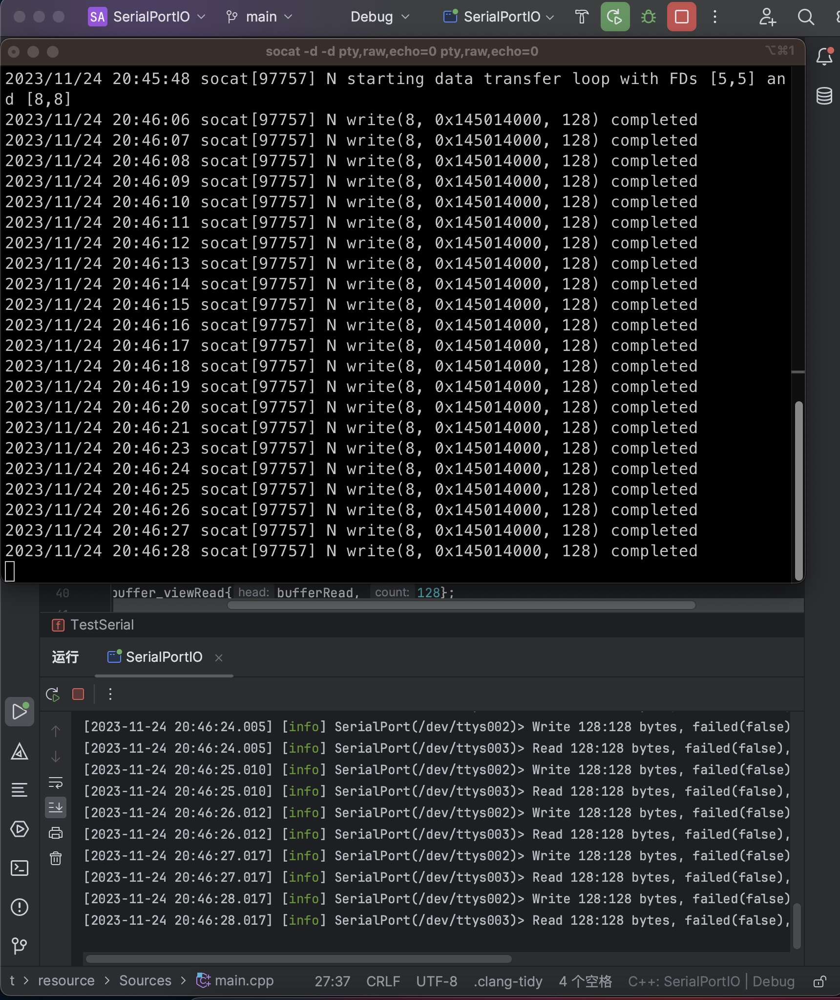
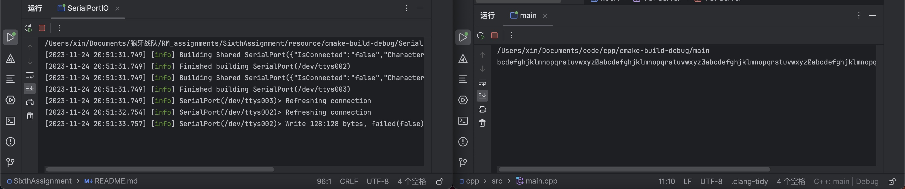
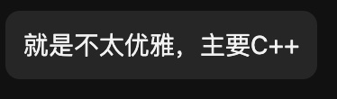
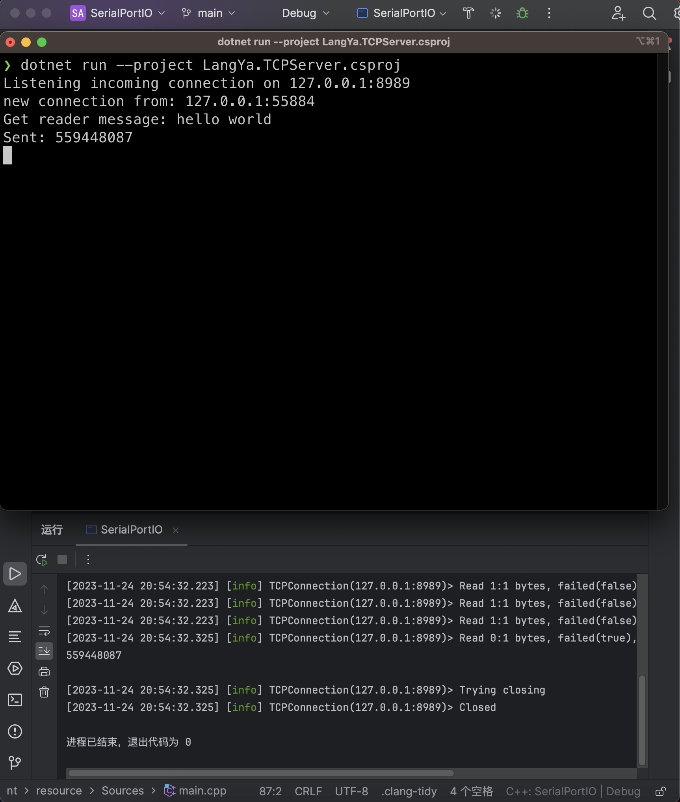

# Sixth Assignment

## 确定项目情况

### 1.背景

robomaster 校内赛

### 2.现状

~~狼牙团队是不会给你提供任何源码的~~

所以需要自己写

### 3. 项目目标

做出通信程序目的是和嵌软进行交互

### 4.开发者信息

刘荣信

### 5.预期结束时间

11.25

### 6.github源码下载地址

[链接](https://github.com/xin700/RM_assignments)

## 虚拟串口通信

直接用resource里面的代码了

~~肯定不是不想写~~

环境是macos，么办法使用Visual Studio了。。。

那就使用socat建立两个虚拟端口进行通讯

简单修改了resource当中的代码，添加了一个read的serial port类

这样都能测试了~~我真是一个天才~~




之后手搓一个很丑很丑的tcp服务器，就几行。。。

```cpp
#include <boost/asio.hpp>
#include <iostream>

namespace MAIN{
    class TCPServer {
    public:
        TCPServer(boost::asio::io_context& io_context, int port)
                : acceptor_(io_context, boost::asio::ip::tcp::endpoint(boost::asio::ip::tcp::v4(), port)),
                  socket_(io_context) {
            StartAccept();
        }

    private:
        void StartAccept() {
            acceptor_.async_accept(socket_,
                                   [this](boost::system::error_code ec) {
                                       if (!ec) {
                                           std::cout << "Client connected." << std::endl;
                                       }

                                       StartAccept();
            });
        }

        boost::asio::ip::tcp::acceptor acceptor_;
        boost::asio::ip::tcp::socket socket_;
    };

    int main() {
        boost::asio::io_context io_context;
        TCPServer server(io_context, 8989);
        io_context.run();
        return 0;
    }
}
namespace TEST{
    inline signed main(){
        return 0;
    }
}
signed main(){return MAIN::main();}
```

之后再使用testTcp





之后使用了简哥的csharp代码



## **优雅！**
