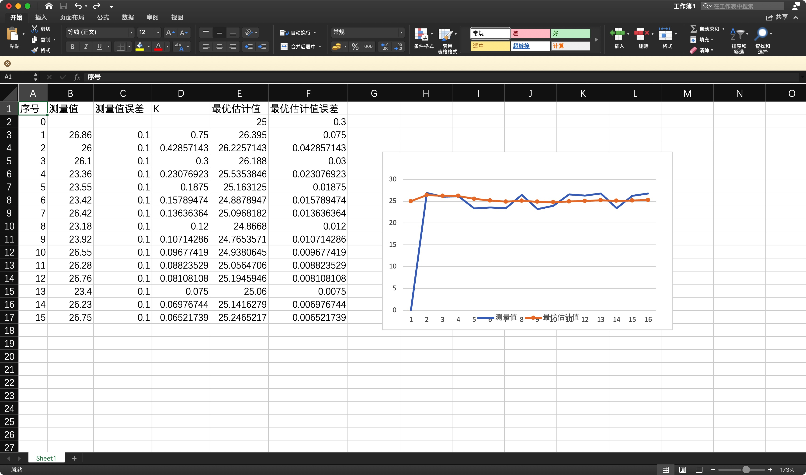
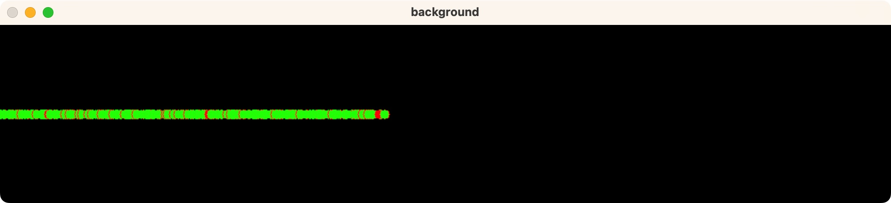
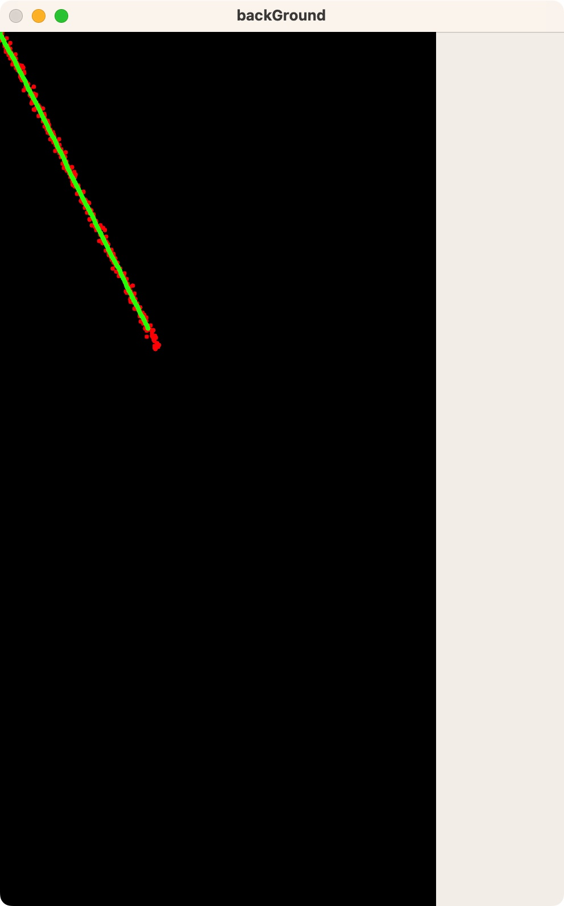
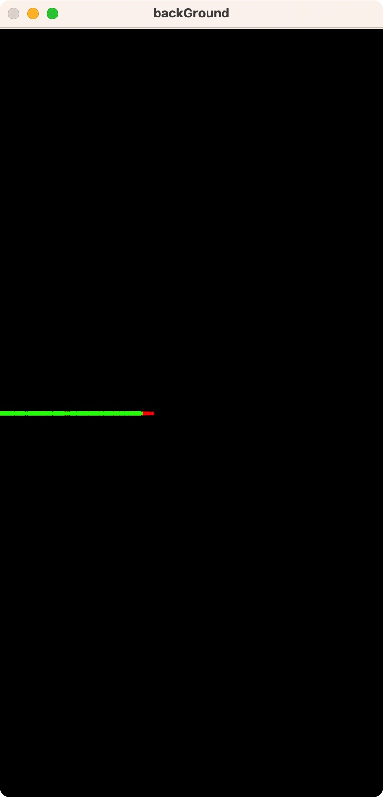

# Fourth Assignment

## 偶对卡尔曼滤波器的理解

卡尔曼滤波器的作用是用来减小趋势噪声的干扰，并且对于下一个运动的状态进行一个较为准确的预测。

预测步骤（预测状态和协方差）：
1. 预测状态：使用系统的动态模型和上一时刻的状态估计，通过状态转移矩阵和控制输入预测当前时刻的状态。
2. 预测协方差：使用系统的动态模型、上一时刻的状态估计和状态协方差，通过状态转移矩阵和过程噪声协方差预测当前时刻的状态协方差。

量测更新步骤（计算卡尔曼增益和更新状态和协方差）：
1. 计算卡尔曼增益：使用测量模型、预测的状态协方差和测量噪声协方差，计算卡尔曼增益。卡尔曼增益反映了预测状态和测量值之间的权衡。
2. 更新状态：使用卡尔曼增益和测量值，将预测的状态与测量值结合起来，得到更准确的状态估计。
3. 更新协方差：使用卡尔曼增益和测量模型，更新状态协方差，以反映测量值对状态估计的影响。

使用代码实现一维的卡尔曼滤波器

```python
measurements = [
5.200,
5.158,
5.129,
5.143,
5.178,
5.126,
5.166,
5.164,
5.185,
5.194,
5.129,
5.108,
5.108,
5.169,
5.163]

initial_state = measurements[0]
initial_covariance = 1 
process_noise = 0.1     
measurement_noise = 0.5 

for i in range(len(measurements)):

    predicted_state = initial_state 
    predicted_covariance = initial_covariance + process_noise  

    measurement = measurements[i]  
    residual = measurement - predicted_state  
    kalman_gain = predicted_covariance / (predicted_covariance + measurement_noise)  # 卡尔曼增益

    updated_state = predicted_state + kalman_gain * residual
    updated_covariance = (1 - kalman_gain) * predicted_covariance

    initial_state = updated_state
    initial_covariance = updated_covariance

    print("Time step:", i+1)
    print("Predicted position:", updated_state)
```

因为线性代数还不太会，所以还没办法理解辣个矩阵的东西

用一个Excel做一个仿真。

搞了一堆数据，大概误差在-2 ~ 2之间，但是围绕25

使用这个函数进行数据生成：`=25+(-1)^RANDBETWEEN(1,2) *RANDBETWEEN(100,200) / 100`

之后制作图标观察趋势：



~~学了b站大佬的思路~~

能看到卡尔曼滤波器把波动的趋势变得很缓，使数据更向真实值去靠拢

~~还得多学学线性代数~~

哦对，这个任务让我画图是吧。。。

```
+------------------+        +-----------------+
|   Prior State    |        |                 |
|   Estimate       |        |  Measurement    |
|                  |        |                  |
|                  v        |                  v
|     +------------+--------+------------+     |
|     |                                 |     |
|     |           Prediction            |     |
|     |                                 |     |
|     +------------+--------+------------+     |
|                  |        |                  |
|                  v        |                  |
|     +------------+--------+------------+     |
|     |                                 |     |
|     |            Update               |     |
|     |                                 |     |
|     +------------+--------+------------+     |
|                  |        |                  |
|                  v        |                  |
+------------------+        +------------------+

```

~~多好一图~~

理解一下：

prior_state_estimate（先验状态估计）：

在 predict 函数中，先验状态估计通过状态转移矩阵和控制向量的线性组合计算得出。
prior_state_estimate = transition_matrix * posteriori_state_estimate + control_matrix * control_vector;
error_cov_post（后验状态估计协方差矩阵）：

在 predict 函数中，后验状态估计协方差矩阵通过状态转移矩阵、过程噪声协方差矩阵的更新计算得出。
error_cov_post = transition_matrix * error_cov_post * transition_matrix.transpose() + process_noise_cov;
measurement_cov_maxtrix（测量协方差矩阵）：

在 predict 函数中，测量协方差矩阵通过测量矩阵、估计状态协方差矩阵和测量噪声协方差矩阵的更新计算得出。
measurement_cov_maxtrix = (measurement_matrix * error_cov_post * measurement_matrix.transpose() + measurement_noise_cov).inverse();
kalman_gain（卡尔曼增益）：

在 update 函数中，卡尔曼增益通过后验状态估计协方差矩阵、测量矩阵和测量协方差矩阵的更新计算得出。
kalman_gain = error_cov_post * measurement_matrix.transpose() * measurement_cov_maxtrix;
posteriori_state_estimate（后验状态估计）：

在 update 函数中，后验状态估计通过先验状态估计、卡尔曼增益和测量残差的线性组合计算得出。
posteriori_state_estimate = prior_state_estimate + kalman_gain * residual;
error_cov_post（更新后的后验状态估计协方差矩阵）：

在 update 函数中，更新后的后验状态估计协方差矩阵通过卡尔曼增益、测量矩阵和后验状态估计协方差矩阵的更新计算得出。
error_cov_post = (Eigen::Matrix<T, x, x>::Identity() - kalman_gain * measurement_matrix) * error_cov_post;

## 一维运动低通滤波器的实现

```cpp
namespace LowFilter {


    inline signed main(){
        Simulator<double, 2> *simulator;
        simulator = new Simulator<double, 2>(Eigen::Vector2d(0, 0), 5);

        int time = 0;
        int preX = 0,nowX = 0;
        cv::Mat backGround(cv::Size(1000,200),CV_8UC3,cv::Scalar(0,0,0));
        while(true){
            Eigen::Vector2d measurement = simulator ->getMeasurement(time ++);
            measurement(1,0) = 0; //强制变成一维，我真是个天才
            nowX = measurement(0,0); //作为测量值

            int predicX = 0.1 * nowX + 0.9 * preX;

            cv::circle(backGround, cv::Point((int)(measurement[0]), int(measurement[1]) + 100), 5, cv::Scalar(0, 0, 255), -1);
            cv::circle(backGround, cv::Point((int)(predicX ), 100), 5, cv::Scalar(0, 255, 0), -1);

            preX = nowX;

            imshow("background",backGround);
            char input = cv::waitKey(2);
            if(input == 'q') break;

        }

        return 0;
    }
}
```



实话说，~~这个图形相比kalman有一种不可名状的丑陋~~

## 二维匀速物体的卡尔曼滤波实现

~~先看结果~~



主要对于KFToolsForStudy进行了一个理解

对于速度矩阵，设计了一个非常简单~~垃圾~~的速度矩阵


$$
A = \begin{bmatrix}
2 \\
1
\end{bmatrix}
$$

也就是 
$$x=x_0+2t \\ y=y_0+t$$

上图也就是运行的kalman的结果


这个是在stimulator里面的改动
```cpp
        Eigen::Matrix<T, x, 1> v;
        v << 1.0, 2.0;
        theoretical = x0 + v * t;
```

main.cpp
```cpp
#include <opencv2/opencv.hpp>
#include <iostream>
#include "../lib/KalmanFilter.hpp"
#include "../lib/Simulator.hpp"

//using namespace cv;
using namespace std;
//using namespace Eigen;

namespace MAIN {
    inline signed main() {
        return 0;
    }
}
namespace TEST {

    inline signed main() {
        srand(114514);

        KalmanFilter<double, 2, 2> *kf;
        kf = new KalmanFilter<double, 2, 2>();
        Simulator<double, 2> *simulator;
        simulator = new Simulator<double, 2>(Eigen::Vector2d(0, 0), 5);

        kf->transition_matrix << 1, 0,
                0, 1;
        kf->measurement_matrix << 1, 0,
                0, 1;
        kf->process_noise_cov << 0.01, 0,
                0, 0.01;
        kf->measurement_noise_cov << 5, 0,
                0, 5;
        kf->control_vector << 0,
                0;


        //修改simulator中的v为(2,1)向量，增加速度变量
        int time = 0;
        cv::Mat backGround(cv::Size(1000,2000),CV_8UC3,cv::Scalar(0,0,0));
        while (true) {
            Eigen::Vector2d measurement = simulator->getMeasurement(time++);
            kf->predict(measurement);
            kf->update();
            Eigen::Vector2d estimate = kf->posteriori_state_estimate;
            cv::circle(backGround, cv::Point((int)(measurement[0] ), int(measurement[1] )), 5, cv::Scalar(0, 0, 255), -1);
            cv::circle(backGround, cv::Point((int)(estimate[0] ), (int)(estimate[1] )), 5, cv::Scalar(0, 255, 0), -1);

            cv::imshow("backGround", backGround);
//            cout << measurement << endl << endl;
            char input = cv::waitKey(10);
            if(input == 'q') break;
        }
        return 0;
    }
}

signed main() { return TEST::main(); }
```

~~为啥还在用TEST命名空间，因为懒得改了~~

当然我~~闲得蛋疼~~,又换了个一维的kalman玩一玩

```cpp
while (true) {
        Eigen::Vector2d measurement = simulator->getMeasurement(time++);
        measurement(1,0) = 0;
        kf->predict(measurement);
        kf->update();
        Eigen::Vector2d estimate = kf->posteriori_state_estimate;
        cv::circle(backGround, cv::Point((int)(measurement[0]), int(measurement[1] + 1000)), 5, cv::Scalar(0, 0, 255), -1);
        cv::circle(backGround, cv::Point((int)(estimate[0]), (int)(estimate[1] + 1000)), 5, cv::Scalar(0, 255, 0), -1);

        cv::imshow("backGround", backGround);
//            cout << measurement << endl << endl;
        char input = cv::waitKey(10);
        if(input == 'q') break;
    }
```


