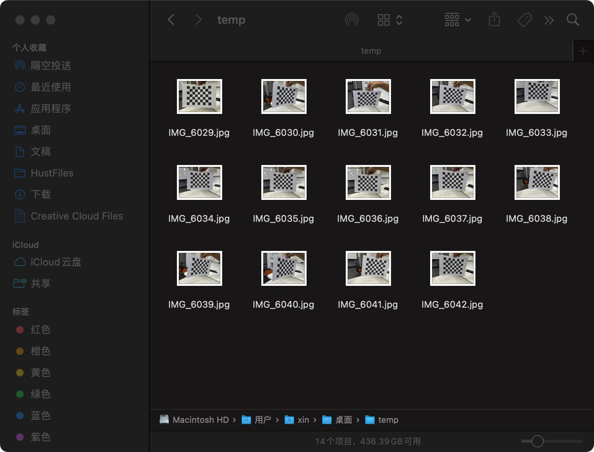
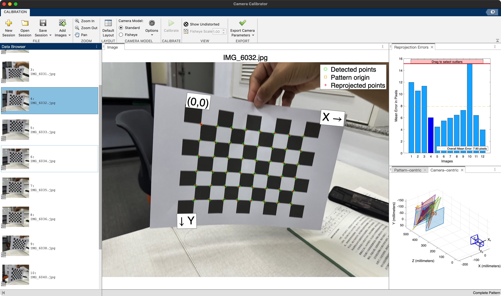
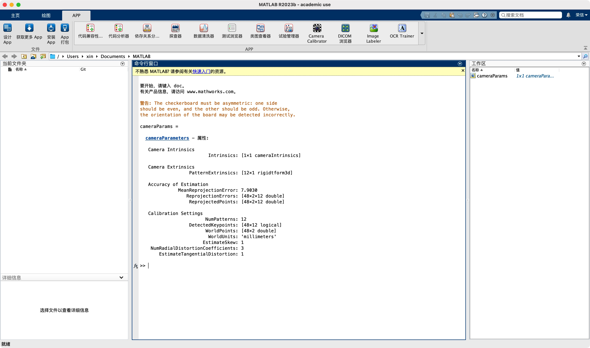
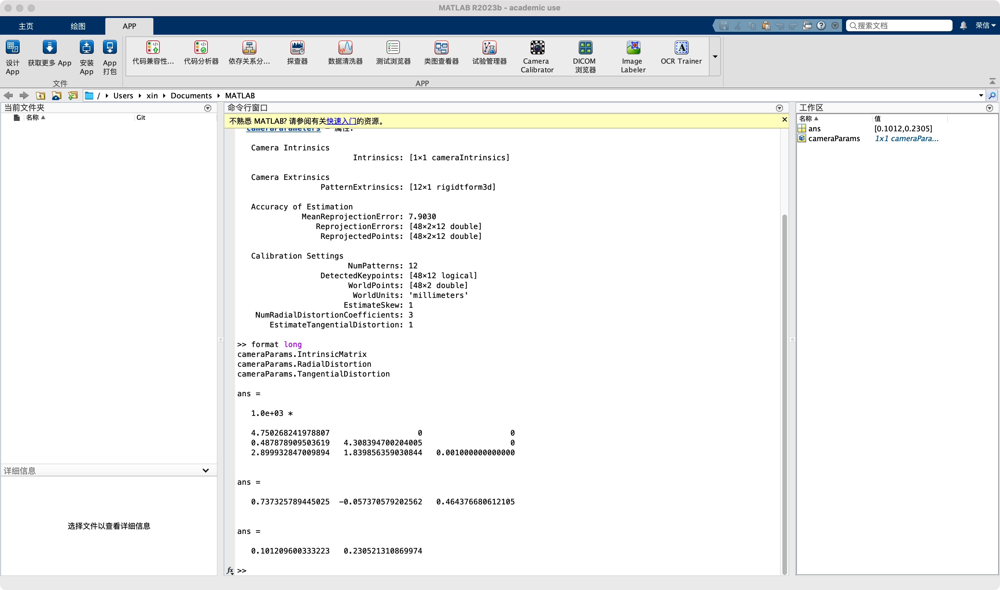
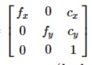
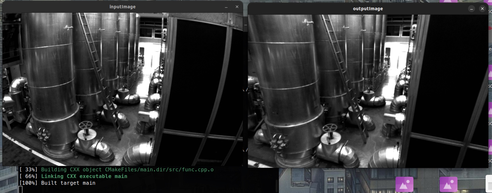

# 第三次作业 (源码均在src文件夹当中)

## T1

线性代数刚学了矩阵的旋转的操作似乎就用上了

使用了Eigen库来创建矩阵

分别输入三个欧拉角的值，之后将三个旋转矩阵合并成R矩阵

使用viz可视化

但是。。。

出现了很多的问题：

```
1.首先是环境的问题，首先在macos装eigen，还是homebrew安装，之后include_directories似乎一切顺利，但是对于opencv的viz库就是装不下来，导致最后启动了linux虚拟机
2. 在Linux虚拟机上又似乎没有什么问题，viz甚至不用装，就在OpenCV里面，但是在写完代码运行的时候，出现的窗口的画面一直是一样的，不论输入什么不同的alpha，beta，gamma，之后在控制台发现了报错。。。

libGL error: pci id for fd 4: 1ab8:0010, driver (null)
1pci id for fd 5: 1ab8:0010, driver (null)

似乎显卡的驱动有问题。。。
然而现在也没有解决。。。
```

## T2

### T2.1

成功在hust的软件站中下载安装激活了MATLAB

下载了Camera calibration用来标定的app，之后使用了25mm的格子拍了14张照片



导入MATLAB



但是只有13张图片被成功识别出来，进行标定，发现有一张图片的x，y轴非常抽象，直接删除



输出参数



获取内参矩阵，感觉数值应该挺合理的。。

~~可能不是很懂这些参数用来干啥吧~~

### T2.2

使用了opencv自带的undistort进行去畸变

定义了矩阵



得到结果



## T3

四个3d坐标[(0,0,0) (0,125,0) (140,0,0) (140,125,0)]

四个2d坐标[(992,900) (986,820) (1074,896) (1064,813)]

3d坐标是考虑的实际的装甲板大小

2d坐标是考虑的是在图片中的像素的位置，只考虑了相对的大小

输出：
Rotation Vector (rvec): [2.942613944926872;
 -0.1862792802562325;
 -0.7691200764356815]
Translation Vector (tvec): [51.22823970172103;
 561.9346460308074;
 2962.90418546723]

~~说实话感觉不太对~~